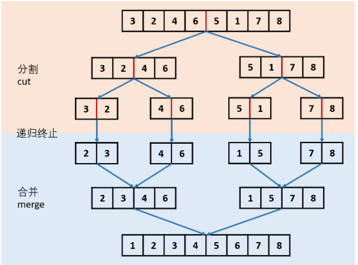

### 题目
[148. 排序链表](https://leetcode-cn.com/problems/sort-list/)

在 O(nlogn) 时间复杂度和常数级空间复杂度下，对链表进行排序。


示例 1:
>输入: 4->2->1->3
输出: 1->2->3->4

示例 2:
>输入: -1->5->3->4->0
输出: -1->0->3->4->5

### 思路
对于排序链表来说，应该想到归并排序，归并排序算法的思想是分治，分而治之，具体请看下图,图来自[link](https://leetcode-cn.com/problems/sort-list/solution/sort-list-gui-bing-pai-xu-lian-biao-by-jyd/),思路也来自图出处


通过递归实现链表归并排序，有以下两个环节：

* 分割 cut 环节： 
找到当前链表中点，并从中点将链表断开（以便在下次递归 cut 时，链表片段拥有正确边界）
我们使用 fast,slow 快慢双指针法，奇数个节点找到中点，偶数个节点找到中心左边的节点。
找到中点 slow 后，执行 slow.next = None 将链表切断。
递归分割时，输入当前链表左端点 head 和中心节点 slow 的下一个节点 tmp(因为链表是从 slow 切断的)。
cut 递归终止条件： 当head.next == None时，说明只有一个节点了，直接返回此节点。

* 合并 merge 环节： 将两个排序链表合并，转化为一个排序链表。
双指针法合并，建立辅助ListNode h 作为头部。
设置两指针 left, right 分别指向两链表头部，比较两指针处节点值大小，由小到大加入合并链表头部，指针交替前进，直至添加完两个链表。
返回辅助ListNode h 作为头部的下个节点 h.next。
时间复杂度 O(l + r)，l, r 分别代表两个链表长度。

```C++
/**
 * Definition for singly-linked list.
 * struct ListNode {
 *     int val;
 *     ListNode *next;
 *     ListNode(int x) : val(x), next(NULL) {}
 * };
 */
class Solution {
public:
    ListNode* sortList(ListNode* head) {
        if(head==NULL || head->next == NULL) return head;
        ListNode* slow = head, *fast = head->next;
        while(fast&&fast->next){
            slow = slow->next;
            fast = fast->next;
        }
        ListNode* head2 = slow->next;
        slow->next = NULL;
        head = sortList(head);
        head2 = sortList(head2);
        return mergeTwoList(head, head2);
    }

     ListNode* mergeTwoList(ListNode* h1, ListNode* h2) {
        if(!h1) return h2;
        if(!h2) return h1;
        if(h1->val < h2->val) {
            h1->next = mergeTwoList(h1->next, h2);
            return h1;
        }
        else {
            h2->next = mergeTwoList(h1, h2->next);
            return h2;
        }
    }
};
```
