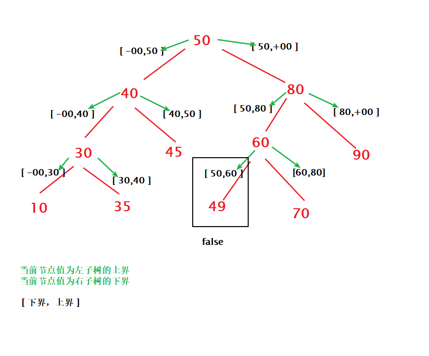

### 题目
[98.验证二叉搜索树](leetcode-cn.com/problems/validate-binary-search-tree/)

给定一个二叉树，判断其是否是一个有效的二叉搜索树。

假设一个二叉搜索树具有如下特征：

* 节点的左子树只包含小于当前节点的数。
* 节点的右子树只包含大于当前节点的数。
* 所有左子树和右子树自身必须也是二叉搜索树。
难度:中等

### 思路:
#### 递归
首先，我们来看二叉搜索树的两个特征：
* 节点的左子树只包含小于当前节点的数。
* 节点的右子树只包含大于当前节点的数。　　

仔细思考这两句话，你可以理解为：

* 当前节点的值是其左子树的值的上界（最大值）
* 当前节点的值是其右子树的值的下界（最小值）



但是在给出代码之前，我们看一看写递归代码必需的两个要素：
* 终止条件
* 深入递归的递归方程

首先来看在这道题中的终止两种终止条件：

当当前节点为空时，表示这个节点已经是叶子节点，这个节点没有子节点，可以返回 True
当当前节点不在 [ min_value,max_value] 的区间时，这个节点不能同时符合二叉搜索树的两个特征，返回 False

然后看看递归方程，由于节点有两个子树，所以我们有两个递归方程要执行：

对左子树：helper(root->left,low,root->val) 解释：当前节点是左子树的上界（你可以粗略地理解为最大值）
对右子树：helper(root->right,root->val,upper) 解释同上
**这个递归过程是最难理解的地方，如果不理解，你可以看一看上图中绿色剪头，你会很快理解这么递归的原因。**

### 代码
```c++
/**
 * Definition for a binary tree node.
 * struct TreeNode {
 *     int val;
 *     TreeNode *left;
 *     TreeNode *right;
 *     TreeNode(int x) : val(x), left(NULL), right(NULL) {}
 * };
 */
class Solution {
public:
    bool helper(TreeNode* root,long long low,long long upper){
        if(root==NULL) return true;
        if(root->val <=low || root->val>=upper) return false;
        return helper(root->left,low,root->val) && helper(root->right,              root->val,upper);
    }
    bool isValidBST(TreeNode* root) {
        return helper(root,LONG_MIN,LONG_MAX);
    }
};
```

#### 中序遍历
中序遍历时，判断当前节点是否大于中序遍历的前一个节点，如果大于，说明满足 BST，继续遍历；否则直接返回 false。
```c++
class Solution {
    long pre = Long.MIN_VALUE;
    public boolean isValidBST(TreeNode root) {
        if (root == null) {
            return true;
        }
        // 访问左子树
        if (!isValidBST(root.left)) {
            return false;
        }
        // 访问当前节点：如果当前节点小于等于中序遍历的前一个节点，说明不满足BST，返回 false；否则继续遍历。
        if (root.val <= pre) {
            return false;
        }
        pre = root.val;
        // 访问右子树
        return isValidBST(root.right);
    }
}


```
### 参考
[参考1](https://leetcode-cn.com/problems/validate-binary-search-tree/solution/yi-zhang-tu-rang-ni-ming-bai-shang-xia-jie-zui-da-/)
[参考2](https://leetcode-cn.com/problems/validate-binary-search-tree/solution/zhong-xu-bian-li-qing-song-na-xia-bi-xu-miao-dong-/)
